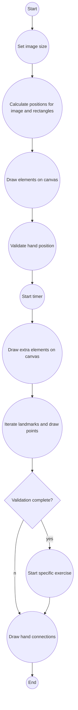
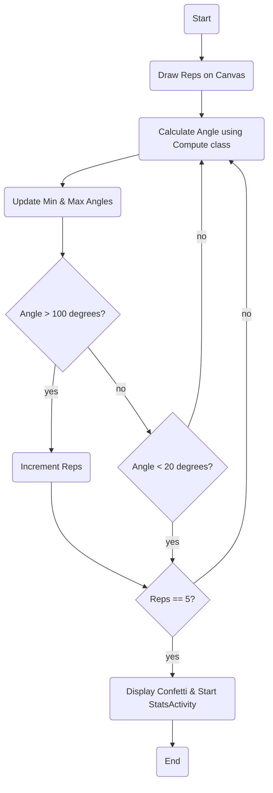
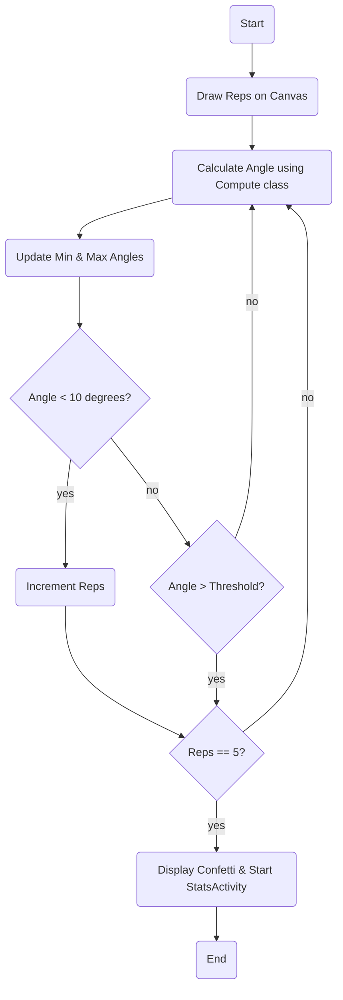
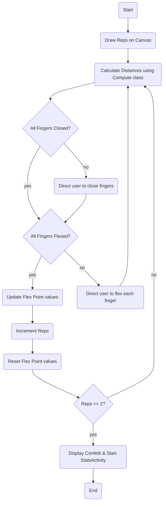
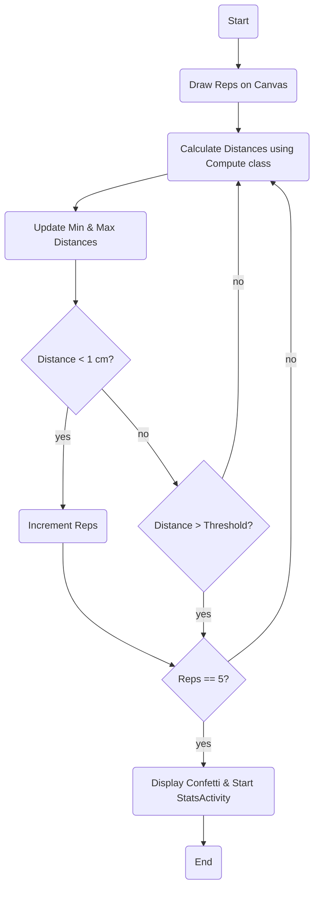

# Hand Therapy using Google Mediapipe

### Overview

This is a camera app that can  detects hand landmarks either from continuous camera frames seen by your device's front camera, an image, or a video from the device's gallery using a custom **task** file.

The task file is downloaded by a Gradle script when you build and run the app. You don't need to do any additional steps to download task files into the project explicitly unless you wish to use your own landmark detection task. If you do use your own task file, place it into the app's *assets* directory.

This application should be run on a physical Android device to take advantage of the camera.

Live KDoc Documnetation: https://green-micaela-61.tiiny.site/index.html

## Flowcharts for Hand Exercise Classes

Below are the flowcharts representing the logic flow for different hand exercise classes in the application.

### OverlayView.kt Flow

Custom view class for displaying hand landmarks, connections, and exercise information.

### H1: Active Wrist Extension (Assisted forearm fixation)

This class represents the Active Wrist Extension exercise, specifically the Assisted Forearm Fixation variation. The exercise involves measuring the angle between two landmarks on the hand.

To start the exercise, you can call the startExercise() method, which requires a Canvas object and a list of NormalizedLandmarks as parameters. The current number of repetitions is displayed on the canvas using the textPaint2 object.

The angle between the landmarks is calculated using an instance of the Compute class. The minimum and maximum angles are updated based on the current angle. Additionally, the number of repetitions is incremented if the angle is greater than 50 degrees.

Once the number of repetitions reaches 5, confetti is displayed on the canvas, indicating the completion of the exercise. Furthermore, an Intent is created to start the StatsActivity, passing in the relevant statistical data. The StatsActivity is responsible for displaying and analyzing the collected data.

### H2: Active & Assisted Forearm Supination

This class represents the Active & Assisted Forearm Supination exercise, which involves measuring the angle between two landmarks on the hand.

To start the exercise, you can call the startExercise() method, which requires a Canvas object and a list of NormalizedLandmarks as parameters. The current number of repetitions is displayed on the canvas using the textPaint2 object.

The angle between the landmarks is calculated using an instance of the Compute class. The minimum and maximum angles are updated based on the current angle. Additionally, the number of repetitions is incremented if the angle is greater than 100 degrees.

Once the number of repetitions reaches 5, confetti is displayed on the canvas, indicating the completion of the exercise. Furthermore, an Intent is created to start the StatsActivity, passing in the relevant statistical data. The StatsActivity is responsible for displaying and analyzing the collected data.

### H3: Active Thumb Abduction + Adduction
This class represents the Active Thumb Abduction + Adduction exercise, which involves measuring the angle between the thumb and index finger landmarks (4, 1, 8).

To start the exercise, you can call the startExercise() method, which requires a Canvas object and a list of NormalizedLandmarks as parameters. The current number of repetitions is displayed on the canvas using the textPaint2 object.

The angle between the landmarks is calculated using an instance of the Compute class. The minimum and maximum angles are updated based on the current angle. Additionally, the number of repetitions is incremented if the angle is less than 10 degrees.

Once the number of repetitions reaches 5, confetti is displayed on the canvas, indicating the completion of the exercise. Furthermore, an Intent is created to start the StatsActivity, passing in the relevant statistical data. The StatsActivity is responsible for displaying and analyzing the collected data.

### H5: Active Finger Flexion & (isolated) Finger Extension
This class represents the Active Finger Flexion & (isolated) Finger Extension exercise. The exercise involves closing all fingers and then flexing them one by one.

To start the exercise, you can call the startExercise() method, which requires a Canvas object and a list of NormalizedLandmarks as parameters. The current number of repetitions is displayed on the canvas using the textPaint2 object.

The distances between specific landmarks are calculated using an instance of the Compute class to determine if the fingers are closed or flexed. The exercise proceeds through a series of steps, directing the user to flex each finger one by one.

When the number of repetitions reaches 2, confetti is displayed on the canvas, indicating the completion of the exercise. Furthermore, an Intent is created to start the StatsActivity, passing in the relevant statistical data. The StatsActivity is responsible for displaying and analyzing the collected data.

### H6: Active Finger Opposition
This class represents the Active Finger Opposition exercise, which involves touching the fingers together and measuring the distance between them.

To start the exercise, you can call the startExercise() method, which requires a Canvas object and a list of NormalizedLandmarks as parameters. The current number of repetitions is displayed on the canvas using the textPaint2 object.

The distances between specific landmarks are calculated using an instance of the Compute class. The minimum and maximum distances are updated based on the current distance. Additionally, the number of repetitions is incremented if the distance is less than 1 cm.

Once the number of repetitions reaches 5, confetti is displayed on the canvas, indicating the completion of the exercise. Furthermore, an Intent is created to start the StatsActivity, passing in the relevant statistical data. The StatsActivity is responsible for displaying and analyzing the collected data.

## Build the demo using Android Studio

### Prerequisites

*   The **[Android Studio](https://developer.android.com/studio/index.html)** IDE. This sample has been tested on Android Studio Dolphin.

*   A physical Android device with a minimum OS version of SDK 24 (Android 7.0 -
    Nougat) with developer mode enabled. The process of enabling developer mode
    may vary by device.

### Building

*   Open Android Studio. From the Welcome screen, select Open an existing
    Android Studio project.

*   From the Open File or Project window that appears, navigate to and select
    the mediapipe/examples/hand_landmarker/android directory. Click OK. You may
    be asked if you trust the project. Select Trust.

*   If it asks you to do a Gradle Sync, click OK.

*   With your Android device connected to your computer and developer mode
    enabled, click on the green Run arrow in Android Studio.

### Models used

Downloading, extraction, and placing the models into the *assets* folder is
managed automatically by the **download.gradle** file.
